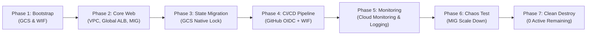
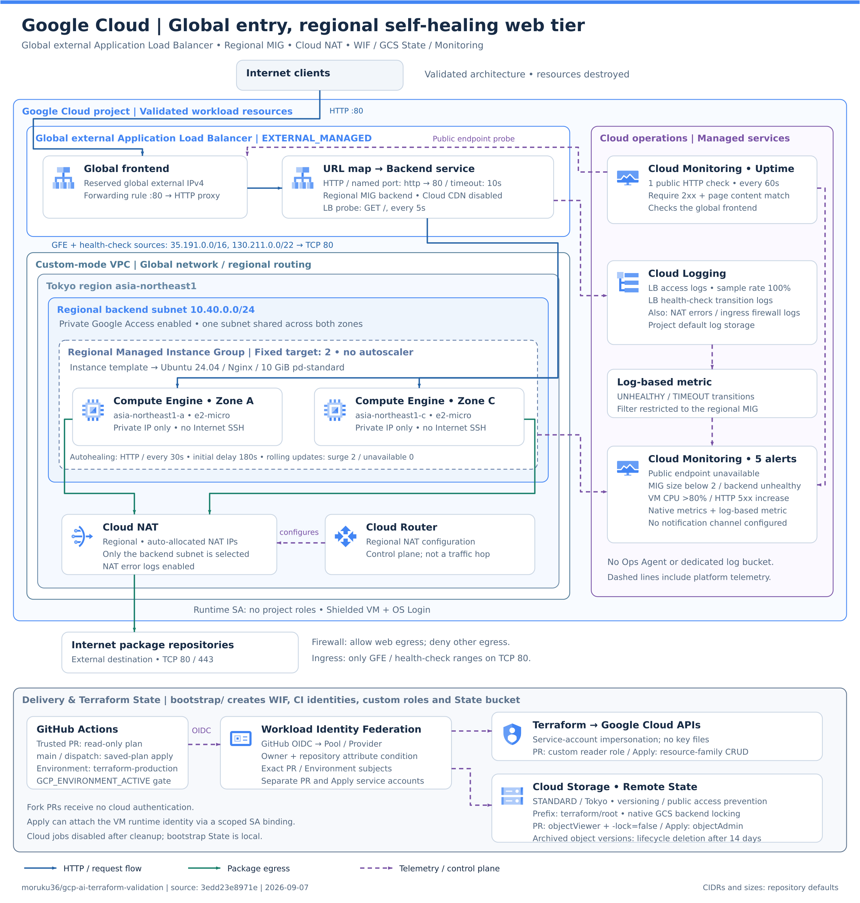
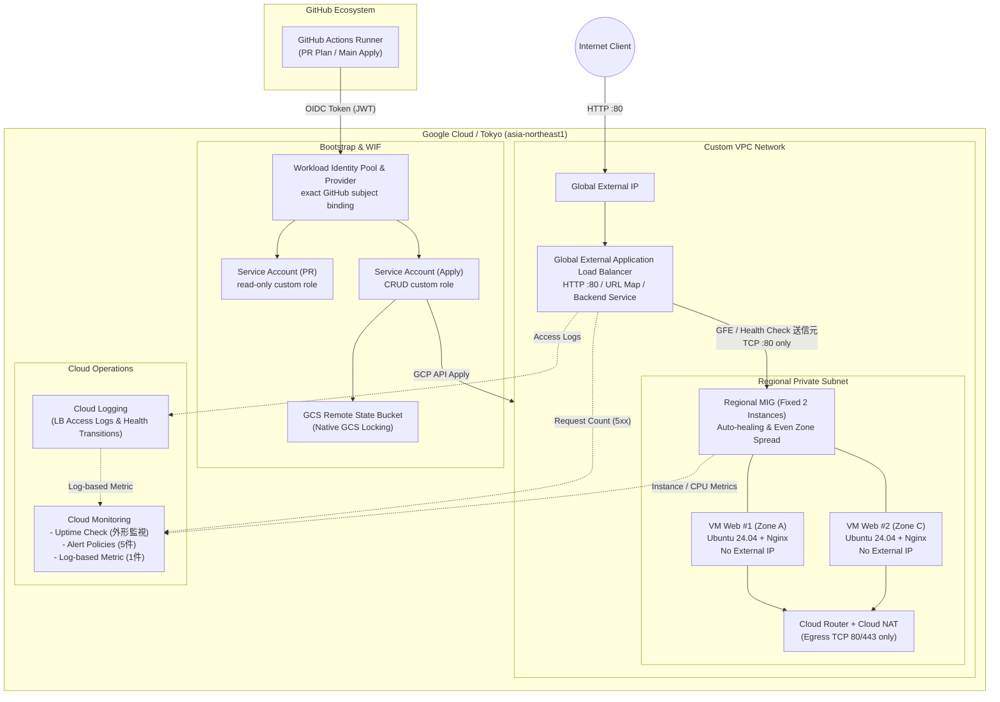

# GCP AI Terraform Validation

**[AWS / Azure / GCP 横断・最終比較レポート](docs/10-multi-cloud-final-report.md)** — 実行結果、AIの失敗と復旧、人間の責任、再現性レビュー。

## 検証目的

自然言語の共通要件から、AI/CodexがGoogle Cloudネイティブな構成を設計し、Terraform、GitHub Actions、Workload Identity Federation、GCS Remote State、Monitoring、障害試験、cleanupまで安全に実装できるかを検証します。

AWS編・Azure編の単純なサービス名置換ではなく、Regional Managed Instance Group、Global External Application Load Balancer、GCP IAM、GCS Backend lockingなどの違いを記録します。

## 検証ライフサイクルフロー



## アーキテクチャ





Internet公開点をGlobal External Application Load Balancerへ集約し、東京リージョンのRegional MIGにあるPrivate VM 2台へHTTPを転送します。VMのpackage取得はCloud NATへ限定し、Cloud Monitoring / Loggingで可用性、Backend、CPU、HTTP 5xxを監視します。GitHub ActionsはWorkload Identity Federationで短期認証し、Terraform Stateはversioningとlockingを有効にしたGCSで共有する構成です。

- Region: Tokyo (`asia-northeast1`)
- Compute: 2 Zoneへ均等配置するRegional Managed Instance Group、固定2台
- Frontend: Global External Application Load Balancer、HTTP 80のみ
- Backend: Ubuntu 24.04、Nginx、External IPなし、Internet SSHなし
- Egress: TCP 80/443だけをCloud NAT経由で許可
- State: 専用GCS Bucketへ移行済み（Versioning / Public Access Prevention / native locking）
- CI/CD: GitHub OIDC + Workload Identity Federation、PR/Apply Identity分離
- Monitoring: Cloud Monitoring、Cloud Logging、Uptime Checkを必要最小限で実装・検証済み

詳細は[アーキテクチャ](docs/02-architecture.md)を参照してください。

## 現在の進捗

- [x] ローカル環境、認証状態、選択中Project、Region/Zone、既存リソース境界を匿名化して確認
- [x] root / bootstrap Terraform初期実装
- [x] `terraform fmt`、`terraform init -backend=false`、`terraform validate`
- [x] 既存gcloudログインの短時間tokenによるread-only plan（root 17 create、bootstrap 13 create、destroy / replaceなし）
- [x] Web基盤apply（17 added / 0 changed / 0 destroyed）とHTTP 200
- [x] GCS Remote State移行、lineage・17リソース一致、locking有効、移行後No changes
- [x] GitHub Actions / WIF実動作
- [x] Monitoringと障害試験
- [x] root / bootstrap cleanupと管理対象リソース残存0確認

> 2026-09-07に構築から障害試験、cleanupまで完了しました。構成は再現用Terraformとして残し、実Project ID、Project Number、Service Account email、Credential、Public IP、State Bucket実名はGitへ保存しません。

## 最終結果サマリー

### 定量評価指標

| 評価指標 | 実績値 / 状況 | ビジュアル指標 |
|---|---|---|
| **総合評価** | **成功（Level 2自律達成）** | `██████████ 100%` |
| **HTTP 200 可用性** | 障害試験中も無停止 | `██████████ 100%` |
| **Root リソース完全削除** | 25 / 25 削除完了 | `██████████ 100%` |
| **Bootstrap 完全削除** | 13 / 13 削除完了 | `██████████ 100%` |
| **管理対象残存リソース** | active 0 件 | `░░░░░░░░░░ 0 件` |

### 検証項目別ステータス

- Terraform: Web基盤17件、Monitoring 7件、bootstrap 13件を管理し、意図しないreplaceなし
- GitHub Actions: PR planとmain saved-plan applyを実行。fork PRにはクラウド認証を渡さない
- Identity: Service Account Keyを作らず、GitHub OIDC + WIFのPR/Apply用exact subjectで認証
- Remote State: versioning / Public Access Prevention付きGCSとbackend標準lockingを検証
- Monitoring: Uptime Check 1、Alert Policy 5、log-based metric 1
- 障害試験: MIGを2台から1台へ縮小してもHTTP 200を維持し、AlertのFired / Resolvedを確認
- cleanup: root 25件、bootstrap 13件をdelete-only planで削除。管理対象はactive 0、既存default networkと既存Service Accountは保護。GitHub cloud jobも無効化

## AWS / Azureとの要点

GCPではRegional MIGによるZone分散と自己修復、Global External Application Load Balancer、Service Account impersonationを採用しました。AWSのAZ別Subnet/EC2、AzureのZone指定VM/Application Gatewayに対し、GCPはBackend lifecycleをMIGへ寄せやすい一方、WIFのPool・Provider・attribute mapping・exact principal文字列は最も切り分け項目が多い構成でした。

## 最終評価

クラウドエンジニアLevel 2相当の設計、Terraform実装、CI/CD、Monitoring、障害切り分け、delete-only cleanupはAI主体で完了しました。人間が必要だったのは初回クラウド変更、exact IAM binding置換、アカウント本人確認などの承認境界です。

## ローカル検証

```powershell
gcloud auth application-default login
$env:TF_VAR_project_id = gcloud config get-value project
terraform init -backend=false
terraform fmt -check -recursive
terraform validate
terraform plan -out=tfplan
```

planを確認するまでapplyしません。Remote State利用時は実Bucket名をコマンド引数または安全なCI設定から渡します。再構築時だけ`GCP_ENVIRONMENT_ACTIVE=true`とし、cleanup後は`false`を維持します。

## ドキュメント

- [検証シナリオ](docs/01-scenario.md)
- [GCPアーキテクチャ](docs/02-architecture.md)
- [Terraform実装](docs/03-implementation.md)
- [トラブルシューティング](docs/04-troubleshooting.md)
- [実行結果・集計](docs/05-results.md)
- [学びとAWS/Azure比較](docs/06-lessons-learned.md)
- [CI/CD・WIF・Remote State](docs/07-cicd-oidc-remote-state.md)
- [Monitoring](docs/08-monitoring.md)
