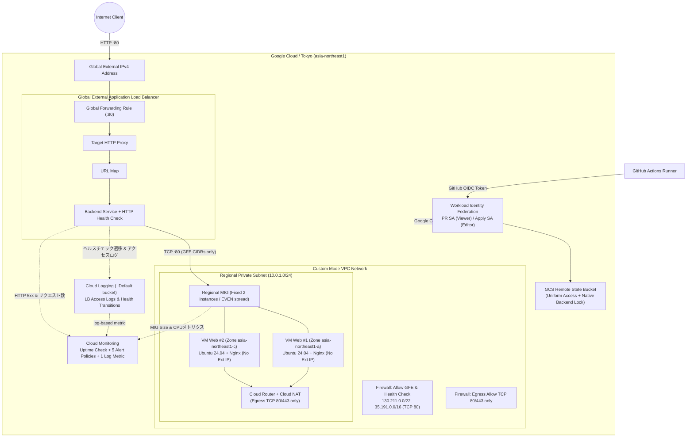

# GCPアーキテクチャ

## 構成図

この図は、Webリクエスト、VMのpackage取得、監視・制御通信を色分けし、Terraformの配信経路とRemote Stateまで含めた検証時の全体構成です。図中のCIDRやサイズはリポジトリ既定値であり、実Project ID、Public IP、Service Account、State Bucket名などの環境固有値は掲載していません。

### 通信と責任範囲

- InternetからのHTTPはGlobal External Application Load Balancerだけが受け付け、URL mapとBackend serviceを介してRegional MIGへ転送する。
- MIGは東京リージョンの2 ZoneへPrivate VMを配置し、Health CheckとautohealingでBackendを維持する。VMにExternal IPは付けず、InternetからのSSHも許可しない。
- BackendへのTCP 80はGFE / Health Checkの送信元範囲だけを許可する。VMからのpackage取得はCloud NAT経由のTCP 80/443に限定する。
- Cloud LoggingへLB access logとhealth-check transitionを保存し、Uptime Check、native metric、log-based metricを5つのAlert Policyで評価する。
- GitHub ActionsはOIDCをWorkload Identity Federationへ交換し、PR用とApply用Service Accountを分離する。長期鍵は使用せず、StateはGCSのversioningとnative lockingで保護する。
- 構築、HTTP 200、Monitoring、障害復旧、cleanupまで検証済みであり、現在クラウド上の検証リソースは削除済み。Terraformコードは再現用に残している。

### 詳細Mermaid図

## 通信ルールとファイアウォール境界

### Firewall ルールマトリクス

| ルール名 | 方向 | 優先度 | 送信元 / 宛先 | ターゲットタグ / 対象 | プロトコル / ポート | アクション | 用途 / 備考 |
|---|---|---:|---|---|---|---|---|
| **`allow-gfe-and-health-check`** | Ingress | 1000 | `130.211.0.0/22` `35.191.0.0/16` | `http-server` (MIG VM) | TCP / 80 | **Allow** | Google Front End (GFE) 及び ヘルスチェッカーからの受信 |
| **既定 Inbound** | Ingress | 65535 | `0.0.0.0/0` | 全インスタンス | Any | **Deny** | インターネットからの直接到達を遮断 (SSH 22含む) |
| **`allow-egress-packages`** | Egress | 1000 | `http-server` (MIG VM) | `0.0.0.0/0` | TCP / 80, 443 | **Allow** | Cloud NAT 経由の apt 更新および Nginx パッケージ取得 |
| **`deny-other-egress`** | Egress | 2000 | `http-server` (MIG VM) | `0.0.0.0/0` | Any | **Deny** | Webパッケージ取得以外の不要な外部通信遮断 |

### ネットワーク設計のポイント

| 項目 | 設計 | 理由 / メリット |
|---|---|---|
| **VPCモード** | Custom Mode VPC | Default VPCの全通ルールを排除し、最小特権のネットワークを構築 |
| **サブネット構造** | 単一Regional Subnet (`10.0.1.0/24`) | GCPのSubnetはリージョン全体に広がるため、AZごとにSubnetを分割する必要がない |
| **アウトバウンド** | Cloud Router + Cloud NAT | VMにExternal IPを持たせず、最小限のポート(80/443)のみをNAT経由で外に出す |
| **ロードバランサー** | Global External ALB (HTTP) | GoogleのエッジPoPで終端し、Googleバックボーンを通じて東京リージョンのMIGに低遅延転送 |

## GCP固有の判断

- **Subnetはリージョン全域スコープ**: AWSやAzureのようにAZごとにSubnetを作成する必要がなく、1つのRegional Subnet内で複数Zone（Zone A, Zone C）へインスタンスを配置できる。
- **Regional MIGによる自己修復**: 固定VMを個別に建てるのではなく、Regional Managed Instance GroupでZone間均等配置（`EVEN`）とヘルスチェック連動の自動再起動（Auto-healing）をTerraformから一体管理。
- **Global External ALBの採用**: どこからアクセスしてもGoogleのグローバルエッジネットワークでトラフィックを受け付け、URL mapとBackend serviceを通じて集約転送。
- **GFE CIDRに限定したBackend保護**: Ingress FirewallをGoogle Cloudの公式プロキシ送信元CIDR（`130.211.0.0/22`, `35.191.0.0/16`）に絞り込むことで、バックエンドへの直接攻撃を完全に防止。
- **Cloud NATの最小利用**: OSパッケージの取得元が外部Ubuntuリポジトリのため、Cloud NATを採用。ただしEgressルールでTCP 80/443のみに限定。
