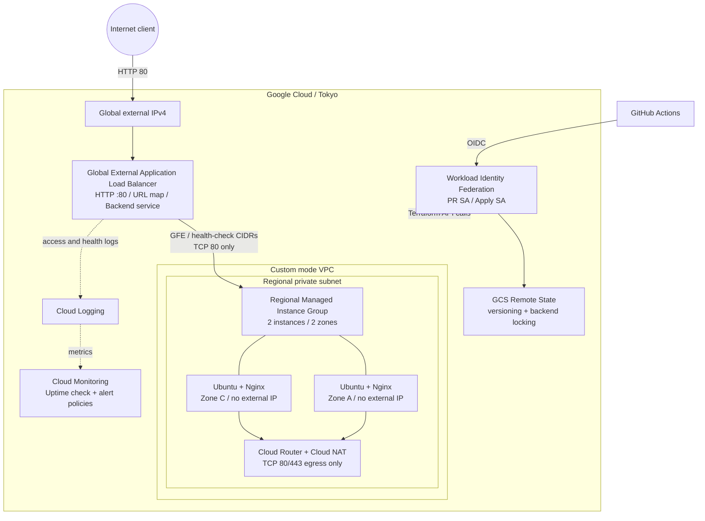

# GCPアーキテクチャ

## 構成図

## GCP固有の判断

- SubnetはリージョンResourceで複数Zoneを包含するため、AZごとのSubnetは作らない。
- Regional MIGの`EVEN`配置で2台を2 Zoneへ分散し、Template、LB連携、自動復旧を一体管理する。
- Global External Application Load Balancerを採用し、GFE経由のHTTP、5xx metric、access log、health checkを利用する。
- Backend FirewallはGFE / Health Checkの公式送信元CIDRからTCP 80だけを許可する。
- Private VMのNginx導入に外部package repositoryが必要なためCloud NATを採用する。VM egressはTCP 80/443に限定する。
- Cloud Armor、Cloud CDN、GKE、Managed Service for Prometheusは今回の検証には過剰なため採用しない。
