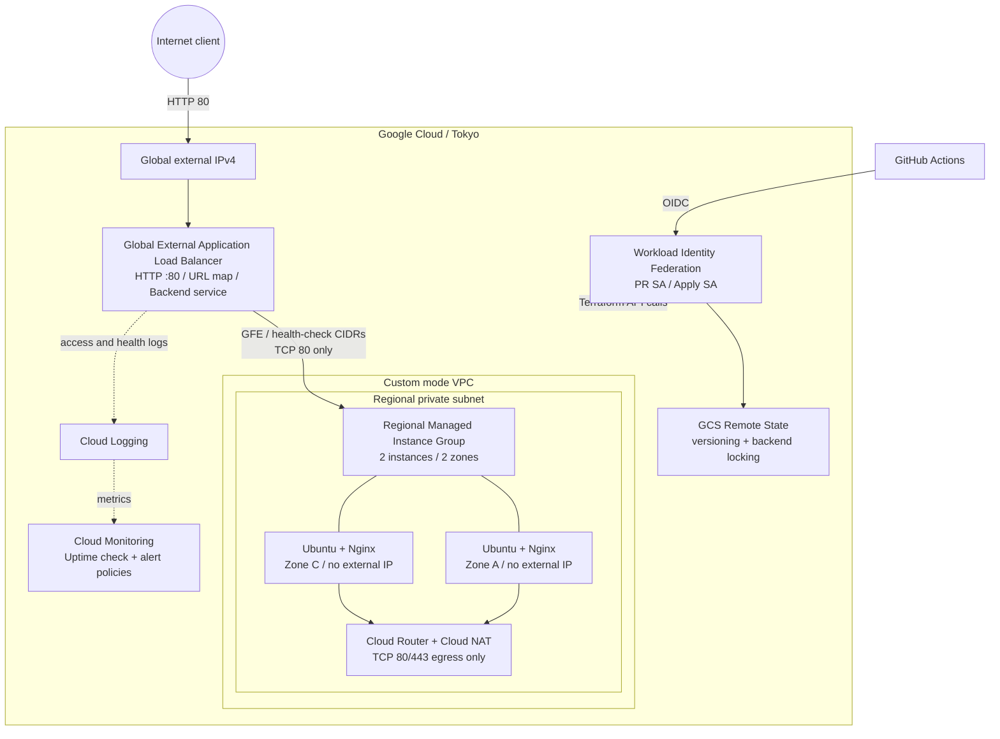

# GCPアーキテクチャ

## 構成図

この図は、Webリクエスト、VMのpackage取得、監視・制御通信を色分けし、Terraformの配信経路とRemote Stateまで含めた検証時の全体構成です。図中のCIDRやサイズはリポジトリ既定値であり、実Project ID、Public IP、Service Account、State Bucket名などの環境固有値は掲載していません。

### 通信と責任範囲

- InternetからのHTTPはGlobal External Application Load Balancerだけが受け付け、URL mapとBackend serviceを介してRegional MIGへ転送する。
- MIGは東京リージョンの2 ZoneへPrivate VMを配置し、Health CheckとautohealingでBackendを維持する。VMにExternal IPは付けず、InternetからのSSHも許可しない。
- BackendへのTCP 80はGFE / Health Checkの送信元範囲だけを許可する。VMからのpackage取得はCloud NAT経由のTCP 80/443に限定する。
- Cloud LoggingへLB access logとhealth-check transitionを保存し、Uptime Check、native metric、log-based metricを5つのAlert Policyで評価する。
- GitHub ActionsはOIDCをWorkload Identity Federationへ交換し、PR用とApply用Service Accountを分離する。長期鍵は使用せず、StateはGCSのversioningとnative lockingで保護する。
- 構築、HTTP 200、Monitoring、障害復旧、cleanupまで検証済みであり、現在クラウド上の検証リソースは削除済み。Terraformコードは再現用に残している。

### 簡易Mermaid図

## GCP固有の判断

- SubnetはリージョンResourceで複数Zoneを包含するため、AZごとのSubnetは作らない。
- Regional MIGの`EVEN`配置で2台を2 Zoneへ分散し、Template、LB連携、自動復旧を一体管理する。
- Global External Application Load Balancerを採用し、GFE経由のHTTP、5xx metric、access log、health checkを利用する。
- Backend FirewallはGFE / Health Checkの公式送信元CIDRからTCP 80だけを許可する。
- Private VMのNginx導入に外部package repositoryが必要なためCloud NATを採用する。VM egressはTCP 80/443に限定する。
- Cloud Armor、Cloud CDN、GKE、Managed Service for Prometheusは今回の検証には過剰なため採用しない。
