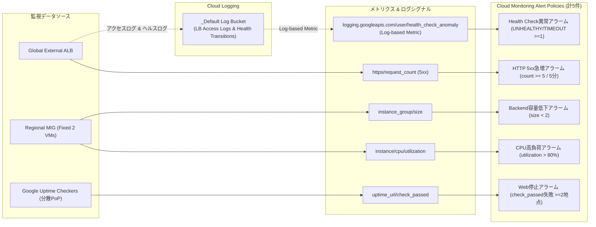
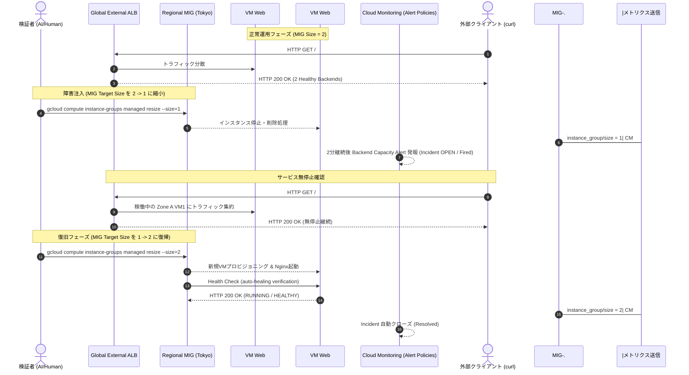

# Monitoring

## 設計

ネイティブメトリクス、外形監視、Health Check状態遷移ログだけを使う。Ops Agent、Log Analytics、BigQuery export、専用Log bucket、Dashboardは追加しない。

| 要件 | データ源 | Alert条件 |
|---|---|---|
| Web停止 | Uptime Check `check_passed` | 2地点以上の失敗が2分継続 |
| Backend / VM capacity異常 | `compute.googleapis.com/instance_group/size` | Regional MIGが2台未満で2分継続 |
| Health Check異常 | Health Check状態遷移log-based metric | `UNHEALTHY`または`TIMEOUT`が1件以上で1分継続 |
| CPU高負荷 | `compute.googleapis.com/instance/cpu/utilization` | 5分平均が80%超で5分継続 |
| HTTP 5xx増加 | `loadbalancing.googleapis.com/https/request_count` | 5分間に5件以上 |

Uptime CheckはHTTP 80で2xxとページ識別文字列を検証する。MIGとHealth Checkの併用により、個別VM IDを固定せず、VM停止、自己修復、Backend異常を追跡できる。

通知先は検証要件で指定されていないためNotification Channelを作らない。Alert PolicyとIncidentはCloud Monitoringで確認できる。本番導入時は組織管理の通知先を追加する。

## ログ

既存Terraformは次を既に有効化していたため、Monitoring追加による既存リソース変更はない。

- Global External Application Load Balancer access log: sample rate 100%
- Load Balancer Health Check: Backend状態遷移log
- 保存先: project標準Cloud Logging `_Default` bucket
- 保持期間: 標準30日

Health Check logは状態遷移時だけ生成され、endpoint削除時には必ずしも生成されない。このためBackend capacity alertも併用する。

## コスト

- Uptime Check: 月100万executionまでのfree allotment内を想定
- Google Cloud標準メトリクス: 非課金メトリクスを使用
- Logging: Health Check状態遷移と低トラフィックのLB access logだけで、少量取り込みを想定
- Alerting: 公式価格では課金開始は2027年9月1日より前には行われない予定。5 metric referenceに限定
- 長期保持、Log export、Ops Agent、Synthetic Monitorは不採用

短時間の検証では監視増分は実質的に小さい見込みだが、実額はトラフィック量とBilling条件に依存する。

## AWS / Azureとの違い

- AWS編のCloudWatch Alarmに対し、GCPはUptime Check、managed-service metrics、Logging metricを組み合わせる。
- Azure編のApplication Gateway metric alertに対し、GCP Health Checkは状態遷移ログが調査の中心になる。
- Regional MIGがVMを自動修復するため、固定VM IDではなくMIG sizeとinstance-name prefixで監視する。
- GCPの外形監視はGoogle分散checkerの結果を集約でき、単一Region内部だけの監視にしない。

## Terraform事前確認

- `terraform fmt -check`: 成功
- `terraform validate`: 成功
- root plan: 7 create、0 change、0 destroy
- 既存Web、Network、Identity、State resourceの更新・置換: なし

## 初回applyと修正

初回main applyは7件中5件を作成後、Monitoring APIのcondition制約により2件で停止した。IAM不足ではなかったため権限追加は行っていない。

- `evaluation_missing_data`を使うconditionのdurationを0秒から60秒へ修正
- 未対応の`COMPARISON_GE`を、同義の`COMPARISON_GT`とthreshold 4へ修正
- 部分適用後のState refreshを実施
- 修正plan: 未作成Alert Policy 2 create、0 change、0 destroy

再applyでHTTP 5xx Alertは作成されたが、Health Check log-based metricのMonitoring resource typeが不一致となった。Cloud Loggingの`gce_instance_group`はMonitoringでは`global`へmappingされるため、Alert filterだけを`global`へ修正した。Logging metric自体のfilterは対象MIGに限定している。

3回目のmain applyで未作成だったHealth Check Alertを追加した。最終結果は次のとおり。

- GitHub Actions: GCS backend初期化、WIF認証、saved plan applyに成功
- 最終apply: 1 added、0 changed、0 destroyed
- Monitoring構成: Uptime Check 1、Alert Policy 5、log-based metric 1
- 最終root plan: No changes
- IAM / WIF /既存Web resourceの変更: なし

## 障害試験

Regional MIGのtarget sizeを一時的に2台から1台へ縮小し、既存Terraform定義は変更せずに容量低下を発生させた。

| 確認項目 | 結果 |
|---|---|
| Backend状態 | 2台から1台へ低下し、残存BackendはHealthy |
| HTTP | 試験中も200を継続 |
| Monitoring metric | `instance_group/size`が2から1へ変化 |
| Alert | `backend capacity below target`がOpen（Fired） |
| 復旧 | target sizeを2へ戻し、2台ともRUNNING / HEALTHY、MIG Stable |
| Resolved | sizeが2へ戻った後、IncidentがClosed |
| Terraform整合性 | 復旧後planはNo changes |

縮小処理とMonitoring収集・Incident評価には数分の遅延があった。復旧中の新VMは一時的にHealth Check `TIMEOUT`となったが、autohealing/verification後にHealthyへ遷移し、サービス停止は発生しなかった。Health Check Alert自体のFiredは今回の短時間試験では確認していない。

## 作業区分

- 人間: Monitoring実装・安全な障害試験の実行承認
- AI: 設計、Terraform実装、plan安全確認、PR作成・merge、applyログ診断、API制約修正、障害注入・復旧、Fired/Resolved確認
- 権限: Monitoring作業でIAM追加なし

## Cleanup

- cleanup前: Uptime Check 1、Alert Policy 5、log-based metric 1をState/APIで確認
- root destroy plan: Monitoringを含む25件すべてdelete-only
- destroy後: Alert Policy、Uptime Check、対象log-based metricはactive 0
- 標準Cloud LoggingのProject既定bucket自体は既存managed serviceであり削除対象外
- Monitoringのために追加したIAM権限はないため、個別IAM cleanupは不要
